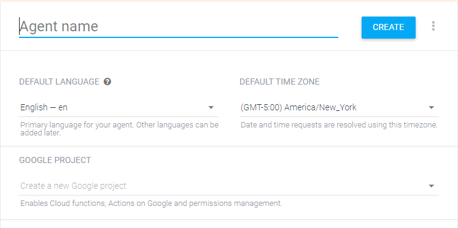
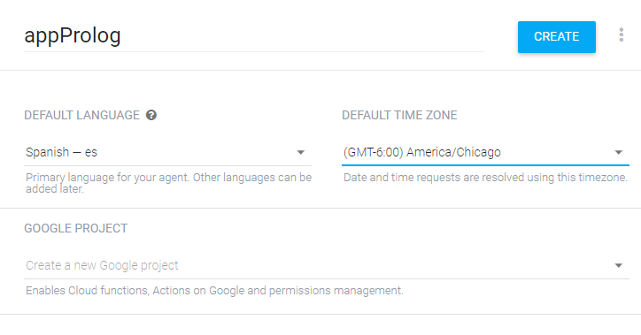
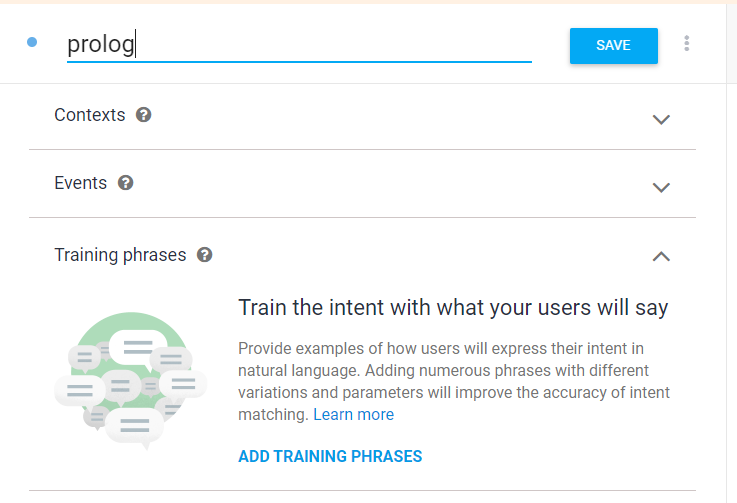

# Integración de Prolog con Python y Twitter

## Introducción

En este trabajo se presenta la implementación de prolog con twitter a traves de python.

## Preparación

Para empezar con la instalación de los requisitos y todo lo necesario puede que sea de su interes leeer este articulo en el que explico a detalle la creación de este proyecto, para solo montarlo no es necesario leerlo pero es recomendable para entender el funcionamiento.

### Requerimientos

- [Python 3](https://www.python.org/downloads/)
- Python pip (administrador de paquetes de python)
- [Heroku cli](https://devcenter.heroku.com/articles/heroku-cli#download-and-install) y Cuenta en [Heroku](https://id.heroku.com/login)
- [SWI-Prolog](http://www.swi-prolog.org/Download.html) (solo para pruebas unitarias de el archivo prolog)
- Cuenta en [DialogFlow](https://dialogflow.com/)
- Cuenta en [Twitter](https://twitter.com) y [Twitter developers](https://developer.twitter.com/en.html)
- [Git](https://git-scm.com/downloads)

### Instalación de bibliotecas de python

Requerimos 2 bibliotecas para hacer que funcione el proyecto, la primera es **pyswip**, la cual nos ayudara a utilizar prolog en nuestros programas de python.
La instalación es de la siguiente manera:  
`pip install pyswip`
  
La segunda biblioteca es **flask**, esta es un microframework que nos permite hacer aplicaciones web de manera muy sencilla y flexible.
Lo instalamos de la siguiente forma:  
`pip install flask`

### Montar Heroku

Heroku es una plataforma que nos brinda la posibilidad de montar un servicio web de manera gratuita, este funciona en un entorno virtual de base Linux y podremos subir nuestros archivos con ayuda de Git, pero primero vamos a crear nuestro proyecto.  
  
En la terminal o el cmd de windows ejecutamos los siguientes comandos una vez tengamos Heroku cli instalado y una cuenta de Heroku.

`heroku login`  
Ingresamos los datos de la cuenta que creamos en Heroku.

`heroku create nombre-api-heroku`  
Creamos el proyecto en Heroku con el nombre que deseemos, este comando nos regresara 2 direcciones que tenemos que guardar, una tiene terminación ".git" que nos servira para subir nuestro proyecto, y la otra ".com" nos servira para acceder al servicio web.

`heroku buildpacks:add --index 1 heroku-community/apt -a nombre-api-heroku`  
Agregamos un buildpack de Heroku que nos permitira agregar paquetes via "Apt" en linux, este nos permitira que se instale el "swi-prolog" que se especifica en el archivo Aptfile.

### Inicializar Git

Para poder subir nuestro proyecto a Heroku ocupamos iniciar el controlador de versiones con Git, en este caso puede que si clonaron el repositorio algunos pasos no sean necesarios, estos comandos deben hacerlos en la dirección raiz del proyecto.  
  
`git init`  
Este inicializa git en el proyecto.  
  
`git add .`  
Luego agregamos los archivos al seguimiento de git.  
  
`git commit -m "mensaje"`  
Agregamos un mensaje a la version que agregamos.

`git remote add heroku https://git.heroku.com/nombre-api-heroku.git`  
Agregamos el repositorio que nos devolvio Heroku cuando creamos el proyecto en Heroku.

`git push heroku master`  
Subimos los cambios a el repositorio de heroku, se empezaran a desplegar mensajes sobre el estado de la instalación en nuestro entorno en Heroku, al final de la construcción deberia notificarnos que se realizo satisfactoriamente.

### Creando el agente en Dialogflow

Dialogflow es una plataforma que nos permitira hacer procesamiento de lenguaje natural y es una ayuda a la creación de ChatBots. En nuestro caso la usaremos para recibir el tweet del usuario y poder procesar la respuesta en nuestro servicio web.

Primero ingresamos al portal de [Dialogflow](https://www.dialogflow.com) y damos clic en el boton "Go to console"

  
Una vez ingresemos a una cuenta de google, creamos un agente. En el caso de que sea la primera vez que usas Dialogflow, veras la siguiente ventana al centro de la pantalla:  

  
En este caso lo dejare de la siguiente manera, con lenguaje en español y agregamos un titulo:  

  
Ahora nos aparece una ventana de intenciones(intents), en esta le daremos clic al boton "Create intent".  

Veremos la siguiente ventana, en la que le pondremos un nombre y le daremos clic a "add training phrases".  

  
Posteriormente escribiremos la frase "frase" y la seleccionaremos con el cursor, deberia salir una ventana con entidades que empiezan con "@sys", en la barra de arriba escribimos any y la seleccionamos, de la siguiente manera:  

  
Realizado el paso anterior, procedemos a bajar y cuando encontremos la parte de **Responses** le damos clic en "add response".  

  
Agregaremos un mensaje que diga "Error en el webhook", este mensaje se ejecuta en caso de que nuestro servicio web no responda dentro de 5 segundos o haga una respuesta incorrecta.  

Para terminar nuestra intención, tenemos que activar fulfillment en la parte inferior, de la siguiente manera.  

Le damos click en "SAVE" en la parte superior derecha para guardar.  
Ahora en el panel de la izquierda le damos click en "Fulfillment".  

Activamos el apartado "Webhook" y en **URL** ponemos el segundo link de heroku, algo como "https://nombre-api-heroku.herokuapp.com/webhook/twitter", notese que al final tenemos la ruta "webhook/twitter" que es donde le mencionamos a nuestro servicio web que aceptara las peticiones.  

Damos clic en "SAVE" y estaria lista la parte de dialogflow.

### Implementando twitter

Por ultimo solo hay que agregar twitter a nuestro proyecto, en este caso necesitamos una cuenta de twitter y requerir acceso a [Twitter developers](https://developer.twitter.com/en/apply-for-access), este proceso preguntara un poco las intenciones de el uso de twitter, hay que extendernos todo lo posible en las explicaciónes que pidan para tener mayor posibilidad de obtener acceso.

Una vez que tengamos acceso, vamos al apartado **apps**.  

Damos clic en el boton "Create an app".  
  

Llenamos los campos de forma descriptiva a lo que hara la app, en la pagina web no importa realmente el dominio mientras sea como prueba.  

Nos aparecera una ventana con 3 pestañas, "app details", "keys and tokens", "Permissions", daremos clic en **Permissions** y luego en "edit".  

Hay que seleccionar la opcion "Read, Write and Direct Messages" y luego dar clic en "SAVE".  

Una vez hecho eso, vamos a "keys and tokens" y en **Access token & access token secret** damos click en "Create".  

Mantenemos esa pestaña abierta, ahora vamos a crear un Entorno de desarrollo, para esto buscamos en el menu superior en la parte derecha "dev environments".  

Veremos la siguiente ventana que contiene 3 entornos de desarrollo, en este caso ocupamos el de **account activity api** el cual nos permite saber cuando nos hacen un tweet, nos envian un mensaje directo, etc.
Para esto damos clic en "Set up dev environment".  

Le asignamos un nombre y seleccionamos la app en la que lo ocuparemos.

Solo faltaria juntar esta parte con dialogflow, para esto hay que ir a la parte de "integrations" en Dialogflow y dar clic sobre Twitter.

Ahora activamos la casilla superior derecha y llenamos cada campo:

- **bot Username**: corresponde al nombre despues del @ de nuestra cuenta de twitter.
- **Consumer key**: la llave correspondiente en "keys and tokens" de nuestra app de twitter. 
- **Consumer Secret**: la llave correspondiente de la app.
- **Access Token**: la llave correspondiente de la app.
- **Access Token Secret**: la llave correspondiente de la app.
- **Dev environment label**: el nombre que le pusimos al "dev environment"
  

Una vez todo puesto, le damos start y seria todo.

## Pruebas

Para testear el bot que hayamos creado, solo hace falta mandarle un tweet o un mensaje directo que diga "cursos (categoria)", en el programa de prolog solo tenemos 4 categorias, pero se pueden poner cuantas quieran.

### Consideraciones de las pruebas
- la categoria debe iniciar en minuscula, de iniciar en mayuscula le estamos indicando a prolog que es una variable
- la categoria debe ser una sola palabra, si son varias palabras hay que usar guión bajo para unirlas
